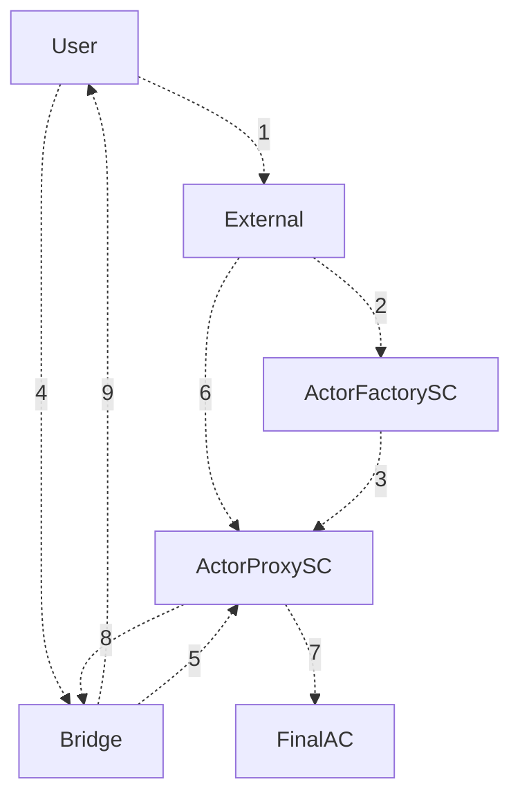

# For Developers

Wrapped smart contracts (WSC) are a powerful protocol that enables the execution of Layer 2 smart contracts directly from Layer 1 wallets. This integration is made possible through the provider object, which adheres to the [EIP-1193](https://eips.ethereum.org/EIPS/eip-1193) standard, acting as a bridge between the EVM provider and the Layer 1 provider. By using WSC, EVM DApps can seamlessly communicate with Layer 1 wallets and execute transactions on Layer 2 smart contracts.


### Architecture

Wrapped Smart Contracts rely on three key components:

- **Smart Contracts** - Similar to wallets like Flint or Metamask in Milkomeda C1, users typically have dedicated accounts. To simplify the process, a smart contract called `Actor` is utilized as an account abstraction, executing actions on behalf of the user.

- **Oracle** - The Oracle is a node.js JSON-RPC API that facilitates message relay between Layer 1 and Layer 2 actors. It provides essential methods for deploying the `Actor` (using the `ActorFactory`) and executing transactions on behalf of users.

- **Provider** - The front-end library injects the provider object based on [EIP-1193](https://eips.ethereum.org/EIPS/eip-1193) into the window.ethereum object. This customized provider includes specific methods like `eth_sendTransaction` or `eth_requestAccounts`, which interact with the Layer 1 wallet and transform the result accordingly.


### Infographics


### Flow

Every single step requires user interaction in the form of a transaction.

- **User Action**: The user initiates an action on an EVM dApp while on the main blockchain. This request is translated into specific parameters for a proxy smart contract.
- **Proxy Deployment and Execution**: A proxy smart contract, reflecting the user's intent, is deployed on the sidechain. The proxy contract then interacts with the appropriate smart contract on the sidechain to execute the desired action.
- **Result Processing**: The outcome from the sidechain smart contract execution is relayed back to the user on the main blockchain. The user's state is updated, and they see the results of their action on the dApp, all while staying on the main blockchain.





1. **User** sends request to create **Actor** with the `tx_data`calling **Final SC**, and get the actor address back. `tx_data` is an encoded transaction which the **Actor** will call on the **Final SC**. (The actor address is derived from the l1 address using the `CREATE2` opcode.)


2. **External** calls the **ActorFactory** to deploy **Actor** with the `tx_data` calling **Final SC**

3. **ActorFactory** deploys **Actor** using CREATE2 based on description of deploy function

4. **User** asserts correct **Actor** address and sends the funds there

5. **Bridge** wraps the funds and sends it to the **Actor**

6. **External** listens to the **Bridge** events and once the funds are wrapped it calls execute

7. **Actor** calls the **FinalSC** on behalf of **User**


8. After execute is complete, **Actor** calls the withdraw which creates a request to the **Bridge**

9. **Bridge** unwraps the funds back to the user


**Note on Gas:** The gas is being paid by the Actor smart contract itself, therefore to execute any transaction the actor needs to have enough balance to pay gas. To fund the Actor smart contract the user should use bridge or dapp should prompt the wallet to send the funds to the Actor through the bridge. 


### Smart contracts

| Contract | Description |
|---|---|
| [Actor](https://github.com/dcSpark/wrapped-smartcontracts/blob/main/packages/contracts/contracts/Actor.sol) | a smart contract to be deployed on the Milkomeda Layer 2 that is bound to the specific L1 address. It serves as an account abstraction: it has a balance, a nonce, and can execute signed transactions on behalf of the user. 
| [ActorFactory](https://github.com/dcSpark/wrapped-smartcontracts/blob/main/packages/contracts/contracts/ActorFactory.sol) | a smart contract deployed on the Milkomeda Layer 2 that is used to deploy actors. It uses CREATE2 opcode to deterministically derive Actor address from the L1 address. |
| [L1MsgVerify](https://github.com/dcSpark/wrapped-smartcontracts/blob/main/packages/contracts/contracts/IL1MsgVerify.sol) | is a precompiled contract that is used to verify the signature of the message signed on the Layer 1 mainchain. |
| CardanoSigVerification | is a precompiled contract that is deprecated, but needed for backwards compatibility with the milkomeda-c1 testnet. |
 


To verify the signature the actor will use the [L1MsgVerify](https://github.com/dcSpark/wrapped-smartcontracts/blob/main/packages/contracts/contracts/IL1MsgVerify.sol) precompiled contract that can verify L1 signatures. The execution will be invoked by the oracle service, which will get exact refund for the gas paid during the execution. |


In the [compile task](https://github.com/dcSpark/wrapped-smartcontracts/blob/main/packages/contracts/tasks/compile.ts) the `Actor` contract is compiled to yul code and prepended with the code to store the transaction gas limit to storage. The gas limit is crucial to the calculation of used gas and to verify that the oracle acted honestly and didn't provide less gas than user signed and therefore the transaction would run out of gas. The yul code is later compiled to the evm bytecode and edited in the artifacts.


### How to integrate

There are two different methods to integrate WSC, ...

#### Option A (WSC Lib)

This option is relatively straightforward to integrate, but it requires some understanding of how the wrapped smart contract functions. 

Its is as a pop-up interface built on top of the Mainchain Wallet, where users need to perform necessary actions such as selecting the asset, wrapping it into Milkomeda, and then they can enter the desired amount in your interface to begin interacting with the protocol (and unwrapping it later on back to mainchain).


**Wrapped Smart Contract Library (WSCLib)** is a TypeScript library designed to simplify interactions with Wrapped Smart Contracts (WSCs). Leveraging the novel concept of WSCs, this library brings the flexibility of executing smart contracts on L2 networks without users needing to leave their L1 environment. This seamless experience eliminates the need for wallet switching or understanding the underlying complexities, offering a new user experience paradigm for blockchain interactions.


**Installation**

Install the library using npm (or yarn)

```bash
npm install wsclib
```


** Usage** 

Here's how you can use WSCLib in your project:

```javascript
import WSCLib, { UserWallet, MilkomedaNetworkName } from 'wsclib';

const network = MilkomedaNetworkName.C1Mainnet;
const wallet = UserWallet.Flint;
const oracleUrl = 'oracleUrl';
const jsonRpcProviderUrl = 'jsonRpcProviderUrl';
const blockfrostKey = 'blockfrostKey';

const wscLib = new WSCLib(network, wallet, {
  oracleUrl,
  jsonRpcProviderUrl,
  blockfrostKey
});

// Inject the library with the necessary dependencies
await wscLib.inject();

// Fetch User's Native Balance
const balance = await wscLib.origin_getNativeBalance();

// logs the user's native balance
console.log(balance); 
```

For more information, check out the [README](https://www.npmjs.com/package/milkomeda-wsc) of the **WSCLib** npm package


#### Option B

This option aims to embed the required user prompts into the EVM DApp UI. When a user attempts to interact with the protocol (e.g., performing a swap), it opens a modal on top of the UI and guides the user through four main steps: wrapping, executing the action, allowing the token to be spend, and finally unwrapping back to the mainchain.


The exemplary flow of the protocol is as follows:

1. The dapp injects the provider.
1. The dapp calls eth_requestAccounts to get the user's L2 address.
1. The provider calls eth_sendTransaction to execute any transaction.
1. The transactions gets to the oracle from provider.
1. The oracle prevalidates the transaction and executes it on the actor.
1. The oracle gets refund for the paid gas.
1. Any uncustomized methods the provider passes to the regular provider node.
