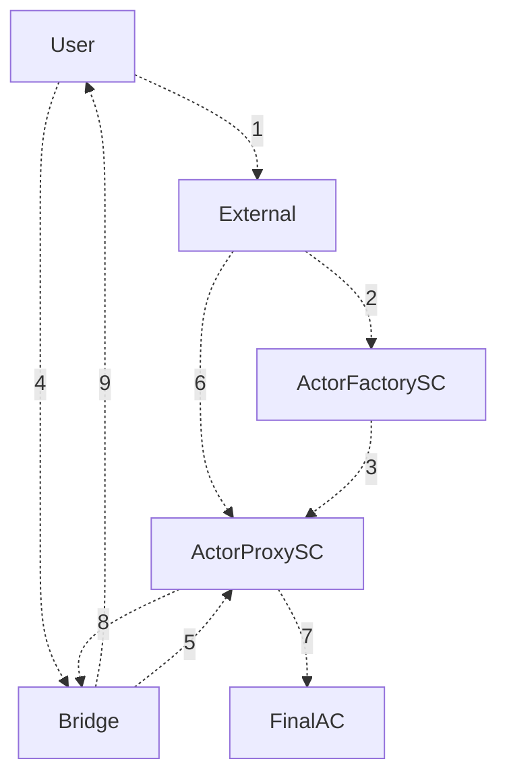

# Overview

Current sidechain/L2 technology alone is not enough to attract both devs and users to migrate to new ecosystems.

### What are Wrapped Smart Contracts?

Wrapped Smart Contracts (WSC) are a new concept aimed at facilitating interaction with smart contracts on sidechains or Layer 2 (L2) solutions without the need for users to leave the security of the Layer 1.

The Layer 1 (L1) blockchain acts as a robust coordination layer, allowing users to execute smart contracts on sidechains or L2 while remaining on the L1 blockchain. This provides a user-friendly experience, as users can interact with various systems without changing wallets or needing a deep understanding of the underlying processes.

Providing such flexibility and power to end users will set a new standard for smart contract enabled blockchains and their ecosystems at large, pushing forward the ones which adopt this new technology with significant traction and interest.

import Tabs from "@theme/Tabs";
import TabItem from "@theme/TabItem";

### How it works

<Tabs>
<TabItem value="simplified" label="Simplified" default>

Every single step requires user interaction in the form of a transaction.

- **User Action**: The user initiates an action on a dApp while on the main blockchain. This request is translated into specific parameters for a proxy smart contract.
- **Proxy Deployment and Execution**: A proxy smart contract, reflecting the user's intent, is deployed on the sidechain. The proxy contract then interacts with the appropriate smart contract on the sidechain to execute the desired action.
- **Result Processing**: The outcome from the sidechain smart contract execution is relayed back to the user on the main blockchain. The user's state is updated, and they see the results of their action on the dApp, all while staying on the main blockchain.

</TabItem>

  <TabItem value="advanced" label="Advanced">

1. **User** sends request to create **Actor** with the `tx_data`calling **Final SC**, and get the actor address back. `tx_data` is an encoded transaction which the **Actor** will call on the **Final SC**

2. **External** calls the **ActorFactory** to deploy **Actor** with the `tx_data` calling **Final SC**

3. **ActorFactory** deploys **Actor** using CREATE2 based on description of deploy function

4. **User** asserts correct \*\*Actor++ address and sends the funds there

5. **Bridge** wraps the funds and sends it to the **Actor**

6. **External** listens to the **Bridge** events and once the funds are wrapped it calls execute

7. **Actor** calls the **FinalSC** on behalf of **User**

8. After execute is complete, **Actor** calls the withdraw which creates a request to the **Bridge**

9. **Bridge** unwraps the funds back to the user

</TabItem>
</Tabs>

### For users

We are working to provide the most seamless UX so that users can interact with the Sidechain with nothing more than their Flint wallet installed. Check out the [example](user_example) for more details

### For developers

If you are interested in developing dapps on the milkomeda layer 2, see the [developers documentation](for_developers). Also, there is a library under packages/milkomeda-wsc that help the development of DApp using WSC. It's also available in npm.
